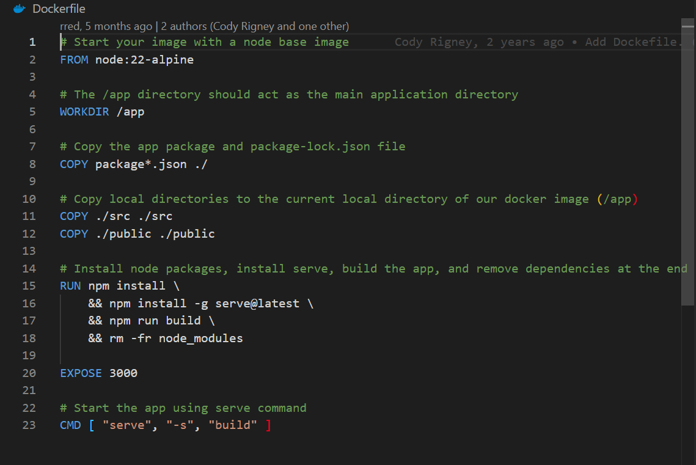
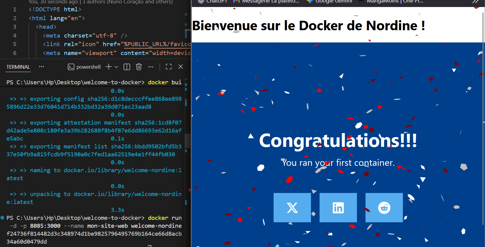

# Projet : Welcome to Docker (Nordine)

Ce projet est un exercice pratique pour apprendre à cloner, modifier et conteneuriser une application web avec Docker.

## 1. Analyse du projet

J'ai commencé par cloner le dépôt et analyser le fichier **Dockerfile**.
Ce fichier contient les instructions pour créer l'image (l'image de base, les fichiers à copier, le port à exposer).



## 2. Construction de l'image (Build)

J'ai construit mon image docker locale en utilisant la commande suivante dans le terminal :

```bash
docker build -t welcome-nordine .
```

## 3. Lancement du conteneur (Correction)

Après avoir analysé les logs (`docker logs`), j'ai vu que l'application écoutait sur le port **3000**.
J'ai donc relancé le conteneur en mappant le port 8085 de mon PC vers le port 3000 du conteneur.

````bash
docker run -d -p 8085:3000 --name mon-site-web welcome-nordine

## 4. Modification du code
J'ai modifié le fichier `index.html` pour personnaliser le titre.
Cependant, pour que la modification soit visible, j'ai dû :
1. Arrêter le conteneur.
2. Reconstruire l'image (pour qu'elle intègre le nouveau code).
3. Relancer le conteneur.

Cela démontre que les conteneurs sont immuables : ils ne changent pas en temps réel si on modifie le code local (sans configuration de volumes).

```
````
